# To Run the Project
- #### You should have an android emulator. I am using Android Studio for the emulator.
- #### Project runned from Pixel 4 API 29, Heap Size 256 (Recommended for high speed).
- #### Check out <a href="https://reactnative.dev/docs/environment-setup">this link</a> to setup React-Native and other softwares on your device
- #### In file folder, open new terminal and do the following:
      # npx react-native start 
- #### Metro has started, now run program on Android device:
      # npx react-native run-android

# About Project
Android based mobile app ensures mobile registeration application which you can apply to transfer to Kocaeli University. It is developed for school project, so it's like prototype. I used Android Emulotor to run on andriod. Firebase Database used to store data. React-Native and Native-Base library used to develop the mobile app.

## Login
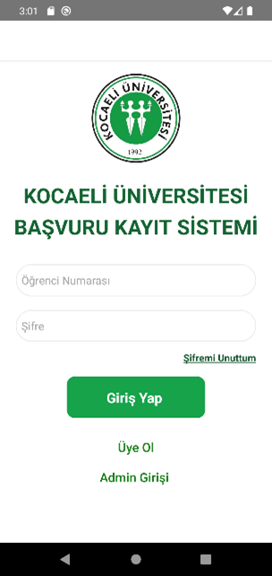

User can login if it registered to the system. There is another button for Admin login. Forgot My Password button is not working unfortunately.

  

## Sign Up
| 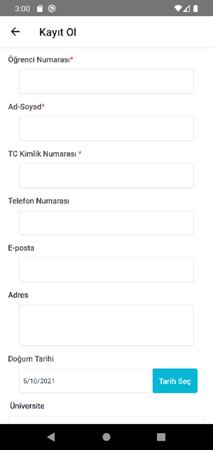 | 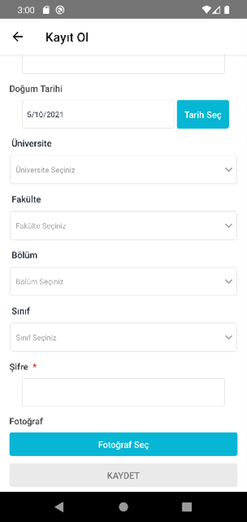 |
| ------------- | ------------- |

User can register itself to the system by using "Kayıt Ol"(Sign Up) button. Data are store in Firebase.

  

## Student Panel
| 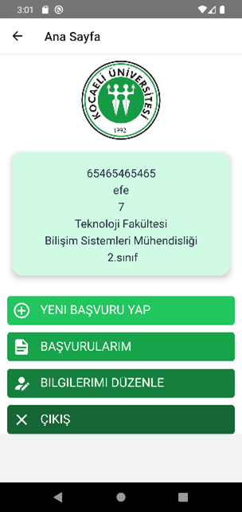 | 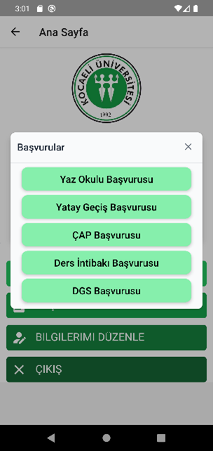 |
| ------------- | ------------- |
| Panel  | Application Options  |

Students can apply application and can edit their informations such as phone number, e-mail... Upper box shows infos about students.

 

| 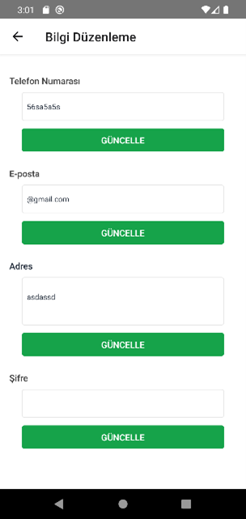 |
| ------------- |
| Edit Information|

  

## Making an Application
| 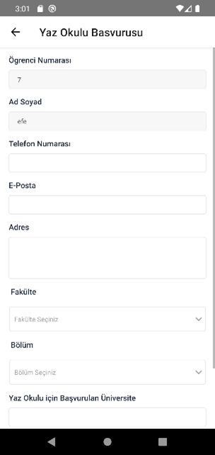 | 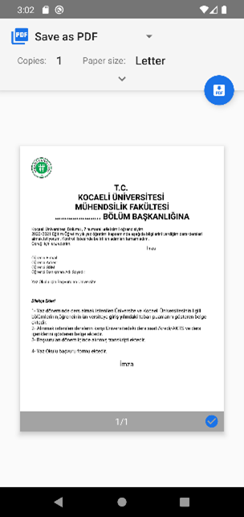 |
| ------------- | ------------- |
| Application Form  | Form to PDF  |

Student should fill the form in order to download application PDF. Application PDF is necessary to apply. This page redirects to file upload page.

 

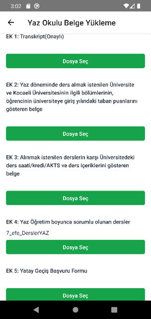

This is file upload page, last step of application. Student must upload all files in order to complete application.

  

## Admin Panel

To login as admin, you have to click "Admin Girişi" button in login page.

 

| 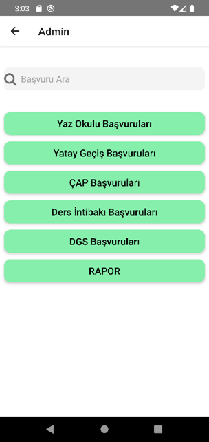 | 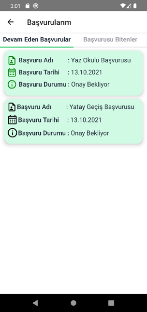 |
| ------------- | ------------- |
| Admin Panel | View Applications |  

This is Admin Panel. Admins can view and apply or reject applications from here

